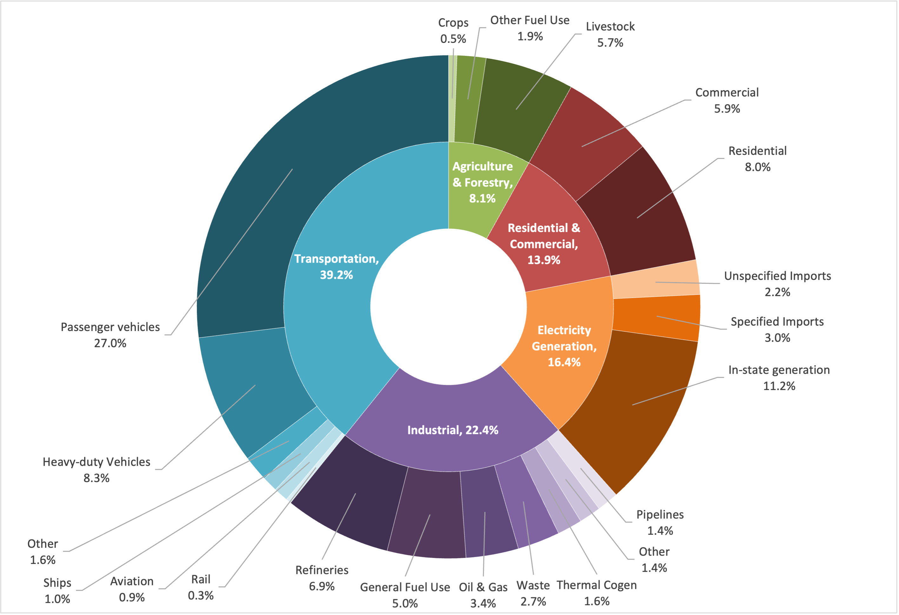
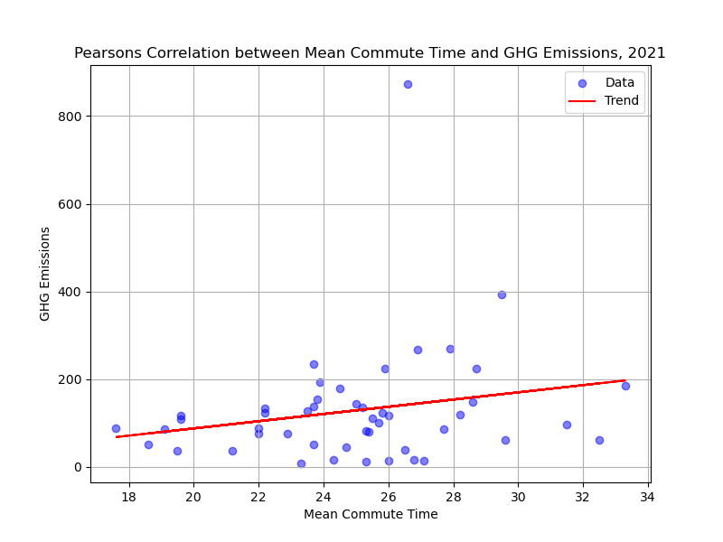
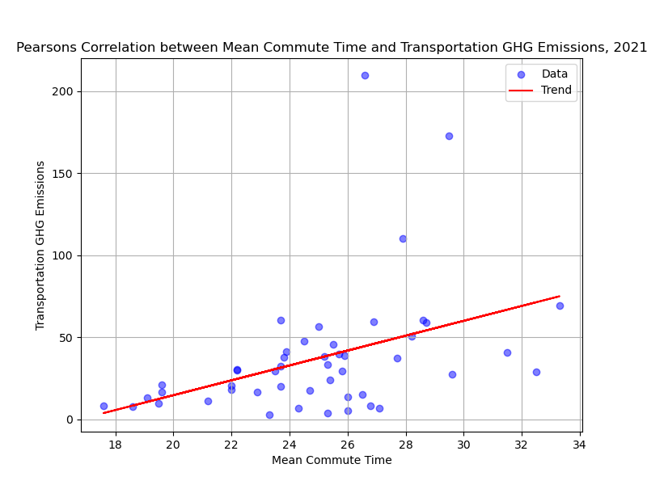
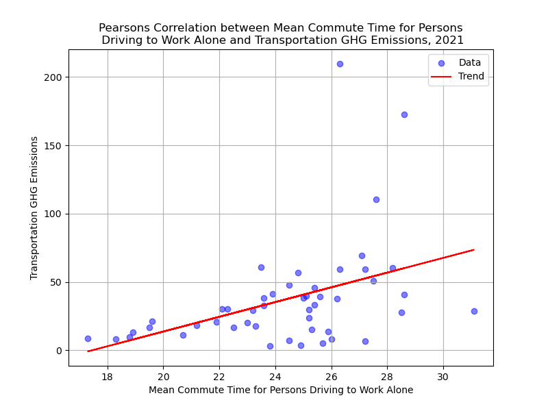
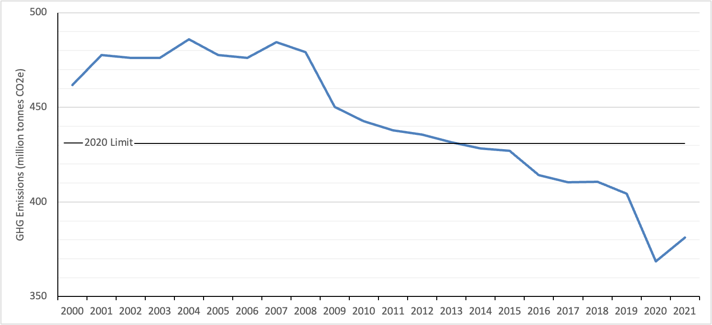
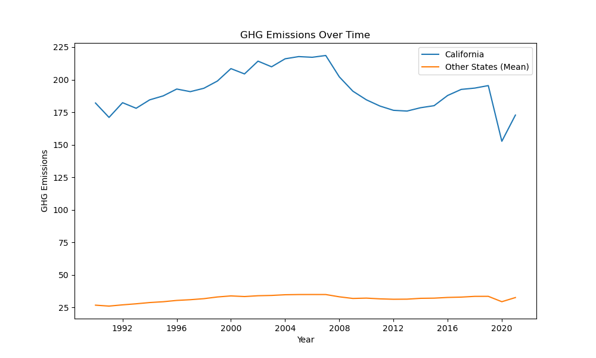

# Transportation and GHG Emissions in California

by Selma Osman

## Background

California is among the states with the highest greenhouse gas emissions. In 2021, California emitted over 393 MMT CO2 eq. This was second only to Texas, which emitted over 873 MMT CO2 eq. You can see the distribution of 2021 greenhouse gas emissions for all 50 states represented below.  

#### Figure #1: 2021 Greenhouse Gas (GHG) Emissions in the United States (US)
<iframe src="StateGHGMapToolTip.html" width="100%" height="600px" frameborder="0"></iframe>

When examining the breakdown of GHG emissions nationally and in California, we find that the transportation sector accounts for the largest share of total GHG emissions. In the US as a whole, the transportation sector makes up 29% of total GHG emissions. In California, this share is even larger, with the transportation sector comprising over 38% of emissions. Furthermore, within the transportation sector, light-duty (or passenger) vehicles make up the largest share of emissions. This trend is seen nationally as well as within California. The chart below illustrates the breakdown of GHG emissions in California in 2021 by sector and subsector.  

#### Figure #2: Breakdown of GHG Emissions in California, 2021

A significant avenue for reducing GHG emissions therefore appears to be to reduce emissions occurring from passenger vehicles. A large component of passenger vehicle emissions stems from people commuting to work. There is actually a relatively strong, significant, positive correlation between driving to work alone and national GHG emissions in 2021. California is the state with the highest number of people driving to work alone. You can see this represented in the map below. 

#### Figure #3: Persons Driving to Work Alone in the US, 2021
<iframe src="StateCommuteToolTip.html" width="100%" height="600px" frameborder="0"></iframe>

## Research Questions

After exploring these trends in overall GHG emissions data and the influence of people driving to work alone on GHG emissions, I was interested in answering the following research question: 

How can we work to reduce GHG emissions from commuting in California?

I break down this research question into two smaller parts, asking:

* Does reducing commute times to work have a significant impact on GHG emissions?
* What effect have transportation policies had on emissions in California?

## Data and Methodology

To answer these questions, I employed various methodologies. First, I conducted a simple Pearson’s correlation between variables of interest related to commute time and GHG emissions. This resulted in correlation coefficients and associated p-values that give insight into the relationship between the variables as well as the statistical significance of that relationship. I also conducted a qualitative review of the main policies associated with transportation emissions reductions in California. After identifying these policies, I conducted a difference-in-difference time series analysis on GHG emissions analyzing the effect of the policies on GHG emissions in California. The results show T-statistics and associated p-values that give a sense of the strength of the relationship and the statistical significance. 
I utilize two main data sources for this analysis. First, I used data from the US Census Bureau American Community Survey. Specifically, I used 5-yr estimates from the 2021 survey to find mean commute times by state. Second, I used data from the US Environmental Protection Agency’s (EPA) Inventory of U.S. Greenhouse Gas Emissions and Sinks to find greenhouse gas emissions by state. 

## Analysis
### Does reducing commute times have a significant impact on GHG emissions?

California's mean commute time to work is relatively high compared to other states, as seen below. 

#### Figure #4: Mean Commute Time to Work in the US, 2021
<iframe src="StateMeanCommuteToolTip.html" width="100%" height="600px" frameborder="0"></iframe>

When comparing mean commute times across all 50 states to overall GHG emissions across all states, we get the following relationship. 

#### Figure #5: Correlation between Mean Commute Time and Overall GHG Emissions in the US, 2021

It appears that there is a weak positive correlation between mean commute times and overall GHG emissions. Furthermore, that relationship is not significant, with a high P value of 0.15. 

However, when comparing mean commute times to GHG emissions in the transportation sector, we do get a significant relationship. The relationship is positive yet relatively weak, with a significant P value of 0.004. 

#### Figure #6: Correlation between Mean Commute Time and Transportation GHG Emissions in the US, 2021
 

Lastly, I examined the relationship between the mean commute time for persons driving to work alone and transportation emissions. This appears to be the strongest relationship between the three and is significant. There is a positive relationship that is slightly stronger than the previous two correlations, and it is significant with a P value of 0.003.  

#### Figure #7: Correlation between Mean Commute Time for Persons Driving to Work Alone and Transportation GHG Emissions in the US, 2021
 

To go back to our research question, it does appear that reducing commute times has some impact on GHG emissions; however, it is within limitations. As we saw in our analysis, mean commute times and overall GHG emissions do not have a significant relationship to each other. However, mean commute times and transportation emissions do have a significant positive relationship. The relationship between mean commute times for persons driving to work alone and transportation emissions was also significant and even more positively correlated to transportation emissions than overall mean commute times. These results make sense, as a longer commute time does not always mean someone is emitting more GHGs. For example, someone biking to work would not emit any GHG emissions no matter their commute time. Similarly, someone taking public transit to work would only emit slightly more GHG emissions with a longer commute time. People driving to work alone are the most likely to emit more GHG emissions with longer commute times. If our goal is to reduce GHG emissions due to commuting in California, then we can try to reduce the amount of time people driving alone to work spend on their commute. This would be a complicated issue as it relies on both housing and transportation. Someone residing closer to their place of work would spend less time driving to work than someone living further away. Similarly, reducing traffic and improving the flow of someone's commute would also reduce their commute time. Alternatively, reducing GHG emissions due to commuting in California can be achieved by moving away from driving to work alone.

### What effect have transportation policies had on emissions in California?

California has implemented many policies related to transportation and emissions over the years. These policies, aimed at addressing climate change, promoting renewable energy, and reducing greenhouse gas emissions, have evolved significantly and have had varied outcomes. I will go over the key policies implemented since the California Air and Resource Board started monitoring greenhouse gas emissions in 1990 in an attempt to understand their effectiveness. 
First, there has been a succession of legislation, in the form of assembly bills (AB) and senate bills (SB), in California to address reducing carbon emissions. One such piece of legislation is AB 32, also known as the Global Warming Solutions Act, which was enacted in 2006. AB 32 aimed to address climate change and reduce greenhouse gas emissions by establishing ambitious targets for reducing GHG emissions, thereby addressing climate change. AB 32 marked the first legislation in the country to implement GHG reduction targets at the state level. The main reduction target was to reduce GHG emissions in CA to 1990 levels by 2020. This was to be achieved through the development and implementation of strategies, policies, and regulations to achieve the reduction target. AB 32 directs that regulations target specific economic sectors, including limiting vehicle emissions in the transportation sector. Since the enactment of AB 32, many regulations and programs have been implemented in the transportation sector, including fuel efficiency standards and vehicle emissions standards, among others. AB 32 has been very successful and significant in reducing GHG emissions in CA. In fact, the 2020 reduction target was met in YEAR, and by 2020, the state had exceeded the reduction target by XXX. You can see this represented in the figure below, showing California’s GHG emissions since 1990, with the 2020 reduction target shown using the horizontal line. Not only has AB 32 spurred changes in CA, but also AB 32 has inspired change in other states and countries to adopt emissions reduction targets. SB 32, enacted in 2016, builds on AB 32 and sets more ambitious reduction targets than the original goal. SB 32 requires that CA reduce emissions to 40% below 1990 levels by 2030. 

#### Figure #8: GHG Emissions in California, 2000-2021, Compared to 2020 Limit

Another important policy in CA’s transportation policy history is the Low Carbon Fuel Standard (LCFS). LCFS was adopted in 2007 and requires a reduction in the carbon intensity of fuels used for transportation. LCFS incentivizes the use of alternative fuels such as biofuels, electricity, hydrogen, and renewable natural gas. In 2015, the LCFS was extended, adding targets to further reduce carbon intensity through 2030. 

California additionally implemented the Zero-Emission Vehicle (ZEV) Program in 1990. ZEV requires vehicle manufacturers in California to produce and sell a certain number of zero-emission vehicles, such as battery electric vehicles (BEVs) and hydrogen fuel cell vehicles (FCVs). The ZEV program targets GHG emissions in the transportation sector by promoting advanced vehicle technologies and increasing consumers' access to clean transportation options. In 2002, CA furthered its vehicle emissions standards to require vehicle manufacturers to improve fuel efficiency and reduce tailpipe emissions, known as the Pavley Regulations. The ZEV program was another instance of CA leading the way, and in 2012, the rest of the nation adopted CA’s standards through the Corporate Average Fuel Economy (CAFE) standards for new vehicles. 

A more recent policy was Executive Order (EO) N-79-20 issued by Governor Gavin Newsom in 2020. This EO requires that all new passenger vehicles sold in CA be zero-emission by 2035. The goal is to phase out gasoline powered cars, accelerate the transition to electric vehicles (EVs), and reduce greenhouse gas emissions from the transportation sector. It is hard to speak to the impacts of this EO as not enough data has been produced since 2020 to speak to long-term impacts on transportation emissions. 

California has implemented other smaller incentives to transition to electric vehicle use. These include purchase rebates and high-occupancy vehicle (HOV) lane access. The Clean Vehicle Rebate Project (CVRP) offers rebates and incentives to consumers who purchase or lease eligible electric vehicles, thereby providing financial incentives to encourage the adoption of electric and plug-in hybrid vehicles. Regarding HOV lane access, eligible electric vehicles and other clean alternative fuel vehicles are granted access even with only one vehicle occupant, aiming to reduce traffic congestion, promote clean transportation choices, and incentivize the purchase of electric vehicles. Additionally, CA has invested in public electric vehicle charging stations through programs such as the California Electric Vehicle Infrastructure Project (CALeVIP) and electric utility programs. 

To assess the impact of these policies on GHG emissions in California, I have conducted a difference-in-difference time series analysis comparing California to other ‘control’ states before and after policy implementation. AB 32, LCFS, and the ZEV program constitute the main policies in California. However, I only conduct the analysis for AB 32 and LCFS as the ZEV program was implemented in 1990, and the GHG emissions dataset begins in 1990, so there would be no pre-policy period to compare against. 

The graph below shows CA’s GHG emissions compared to the mean emissions from other states. We can see that California’s emissions are much higher than other states. This makes sense as California has a larger population than other states. One noticeable visual difference is the drop in 2007 and again in 2019. Could the earlier drop be a direct result of AB 32 or LCFS?

#### Figure #9: California GHG Emissions Compared to Other States

The difference-in-difference time series analysis helps to answer this question. When conducted for AB 32, the results are not statistically significant due to a high P value of 0.14. Therefore, we cannot say whether the AB 32 policies have had an effect on GHG emissions in California. However, when conducted for LCFS, the P value is much smaller at around 0.04, meaning that we are able to reject the null hypothesis. This leads us to the conclusion that there is a statistically significant probability that LCFS has had an effect on GHG emissions post its 2007 implementation. 

## Conclusion

## References
California Air Resources Board. (2021). Clean Vehicle Rebate Project. Retrieved from https://cleanvehiclerebate.org/eng

California Air Resources Board. (2021). High Occupancy Vehicle (HOV) Lane Access. Retrieved from https://ww2.arb.ca.gov/our-work/programs/high-occupancy-vehicle-hov-lane-access

California Air Resources Board. (2021). Hybrid and Zero-Emission Truck and Bus Voucher Incentive Project. Retrieved from https://ww2.arb.ca.gov/our-work/programs/hybrid-and-zero-emission-truck-and-bus-voucher-incentive-project

California Air Resources Board. (2021). Low Carbon Fuel Standard. Retrieved from https://ww2.arb.ca.gov/our-work/programs/low-carbon-fuel-standard

California Air Resources Board. (2021). Low Carbon Fuel Standard Amendments. Retrieved from https://ww2.arb.ca.gov/our-work/programs/low-carbon-fuel-standard/low-carbon-fuel-standard-amendments

California Air Resources Board. (2021). Overview of AB 32. Retrieved from https://ww2.arb.ca.gov/our-work/programs/ab-32-program

California Air Resources Board. (2021). Vehicle Emissions Standards. Retrieved from https://ww2.arb.ca.gov/our-work/programs/vehicle-emissions-standards

California Air Resources Board. (2021). Zero-Emission Vehicle Program. Retrieved from https://ww2.arb.ca.gov/our-work/programs/zero-emission-vehicle-program

California Energy Commission. (2021). California Electric Vehicle Infrastructure Project (CALeVIP). Retrieved from https://calevip.org/

California Legislative Information. (n.d.). Assembly Bill No. 32. Retrieved from https://leginfo.legislature.ca.gov/faces/billNavClient.xhtml?bill_id=200520060AB32

California Legislative Information. (n.d.). Senate Bill No. 32. Retrieved from https://leginfo.legislature.ca.gov/faces/billNavClient.xhtml?bill_id=201520160SB32

California Public Utilities Commission. (2021). Electric Vehicles. Retrieved from https://www.cpuc.ca.gov/ev/

Office of Governor Gavin Newsom. (2020). Executive Order N-79-20. Retrieved from https://www.gov.ca.gov/2020/09/23/governor-newsom-announces-california-will-phase-out-gasoline-powered-cars-drastically-reduce-demand-for-fossil-fuel-in-californias-fight-against-climate-change/

U.S. Census Bureau. "MEANS OF TRANSPORTATION TO WORK BY SELECTED CHARACTERISTICS." American Community Survey, ACS 5-Year Estimates Subject Tables, Table S0802, 2021, https://data.census.gov/table/ACSST5Y2021.S0802?t=Commuting&g=010XX00US$0400000. Accessed on May 7, 2024.

U.S. Environmental Protection Agency. (2021). Federal Vehicle Emissions Standards. Retrieved from https://www.epa.gov/regulations-emissions-vehicles-and-engines/regulations-greenhouse-gas-emissions-passenger-cars-and

U.S. Environmental Protection Agency. (2022). Inventory of U.S. Greenhouse Gas Emissions and Sinks. Retrieved from https://www.epa.gov/ghgemissions/inventory-us-greenhouse-gas-emissions-and-sinks
